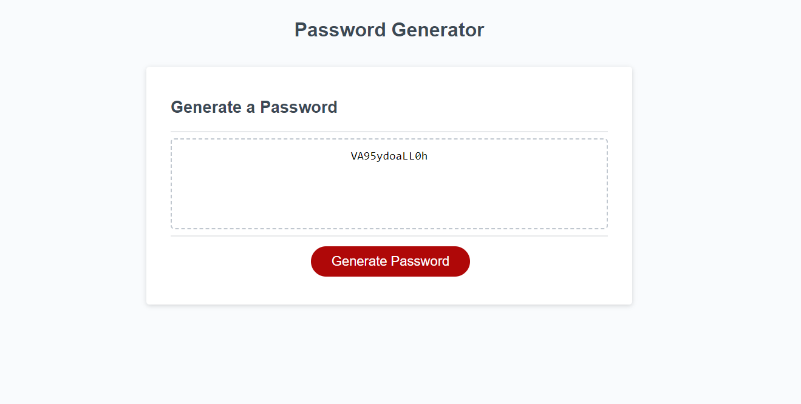

# Challenge-3
This is a randomized password generator that was coded through JavaScript to be interactive with a user to create a password with characters and length of their choosing.

# Expectations
With the html and css files provided, the first step was deciphering what every part of the prefilled Javascript was written to complete. The goal then became defining the function of generatePassword().

First, a prompt was written to begin the input process from the user. a return and an alert message was staged in case the input wasn't a number, or it did not meet the requirements of being an integer between 8 and 128.

A series of confirmations were created to allow the user to decide which characters would be allowed into the randomization. each boolean concatenated when true to create the pool of characters to be allowed into the 'for' loop.

The loop had to provide a return result that had been converted back into a string to be input as a text value with the proper amount of characters selected by the user after being pushed from the loop. The prewritten code completed the rest of the engine.

# Finished Work

# Links
*